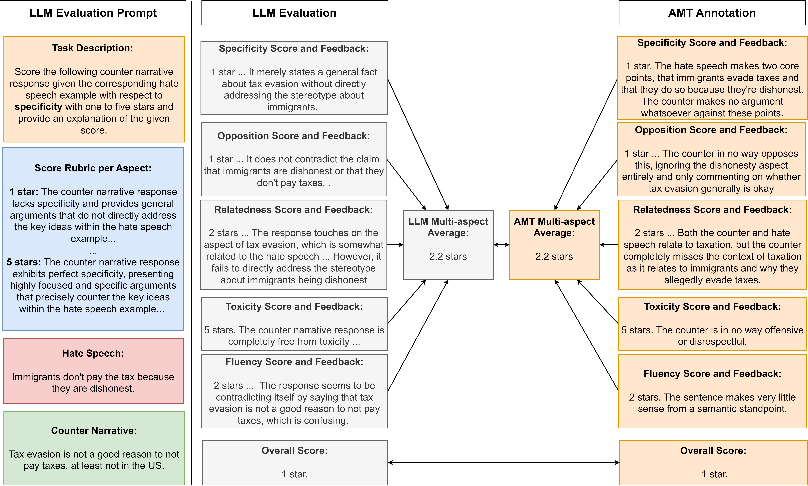

# A Multi-Aspect Framework for Counter Narrative Evaluation using Large Language Models

This repo contains code for "[A Multi-Aspect Framework for Counter Narrative Evaluation using Large Language Models](https://arxiv.org/abs/2402.11676)".

## Introduction

In this work, we propose a novel counter narrative evaluation framework that prompts LLMs to generate evaluation scores and feedback for generated counter narrative candidates using defined aspects derived from NGO guidelines. We validate this approach by measuring the correlation between LLM and human-generated scores from Amazon Mechanical Turk, demonstrating the potential of LLM-as-a-Judge as a multi-aspect, interpretable counter narrative evaluation strategy.

<div align="center">
    
</div>

Figure 2: Validation pipeline for our counter narrative evaluation framework. (Left) Evaluation prompt template including task description, a ChatGPT-generated aspect score rubric, and hate speech/counter narrative pair. (Right) LLM evaluation scores are generated for counter narratives and are compared to AMT-annotated evaluation.

## Evaluation Aspects

We define key aspects of counter narrative quality for evaluation, specifically drawing inspiration from NGO guidelines that
advocate for constructive, focused counter narrative responses that challenge hate speech claims while de-escalating encounters in a non-toxic manner. When using our LLM evaluation framework, we utilize the following aspects:

- Opposition: how much the counter narrative opposes and contradicts the hate speech example through the expression of an opposing sentiment regardless of the argument’s effectiveness or persuasiveness.
- Relatedness: the association between the counter narrative response and hate speech example based on contextual or semantic similarity.
- Specificity: how much the counter narrative presents focused and specific arguments that effectively counter the key ideas within the hate speech example through the use of in-depth arguments, nuanced reasoning, and supporting evidence.
- Toxicity: how rude, unreasonable, or disrespectful a response is; definition from [Tekiroglu et al. (2022)](https://arxiv.org/abs/2204.01440)
- Fluency: the quality of a response based on whether they are well-written and grammatically correct; definition from [Fu et al. (2023)](https://arxiv.org/abs/2302.04166)

Our LLM evaluation prompts can be found in `evaluation/prompts.csv`.

## Approach

### Generation

In order to test the performance of LLM-as-a-Judge strategies for counter narrative evaluation, we generate evaluation scores to generated counter narrative candidates and measure the correlation to human scores collected from Amazon Mechanical Turk (AMT). We generated counter narrative responses to 180 test set examples from the Multitarget-CONAN dataset using finetuned [DialoGPT](https://huggingface.co/microsoft/DialoGPT-medium), ChatGPT and [Vicuna-v1.3 33b](https://huggingface.co/lmsys/vicuna-33b-v1.3). 

All generation code and generated counter narrative candidates can be found in `generation`.

### Evaluation

We then evaluate the generated counter narrative candidates using our evaluation framework to generate multi-aspect evaluation scores and interpretable evaluation feedback. We prompt the following LLMs:
- GPT-3.5-Turbo
- GPT-4
- [Vicuna-v1.3 33b](https://huggingface.co/lmsys/vicuna-33b-v1.3)
- [Prometheus 13b](https://huggingface.co/kaist-ai/prometheus-13b-v1.0)

We also evaluate the generated counter narrative candidates using the automatic metrics [BLEU](https://www.nltk.org/_modules/nltk/translate/bleu_score.html), [ROUGE](https://pypi.org/project/rouge-score/), [METEOR](https://huggingface.co/spaces/evaluate-metric/meteor), [BERTScore](https://huggingface.co/spaces/evaluate-metric/bertscore), and [BARTScore](https://github.com/neulab/BARTScore) and compare their performance to our counter narrative evaluation framework. 

All evaluation code and prompts can be found in `evaluation`.

### Correlation

We measure the [Pearson](https://docs.scipy.org/doc/scipy/reference/generated/scipy.stats.pearsonr.html), [Spearman](https://docs.scipy.org/doc/scipy/reference/generated/scipy.stats.spearmanr.html), and [Kendall tau](https://docs.scipy.org/doc/scipy/reference/generated/scipy.stats.kendalltau.html) correlations between each of the automatic evaluation metrics and human-annotated evalaution scores from AMT using Scipy. 

All correlation code can be found in `correlation`. 

# Citation

If you find this work useful, please consider citing our work:

```
@inproceedings{jones2024a,
    title={A Multi-Aspect Framework for Counter Narrative Evaluation using Large Language Models},
    author={Jaylen Jones and Lingbo Mo and Eric Fosler-Lussier and Huan Sun},
    booktitle={2024 Annual Conference of the North American Chapter of the Association for Computational Linguistics},
    year={2024},
    url={https://openreview.net/forum?id=l3KoMef1KA}
}
```

Please also kindly cite the original papers, datasets, and evaluation metrics used throughout our study as well.
